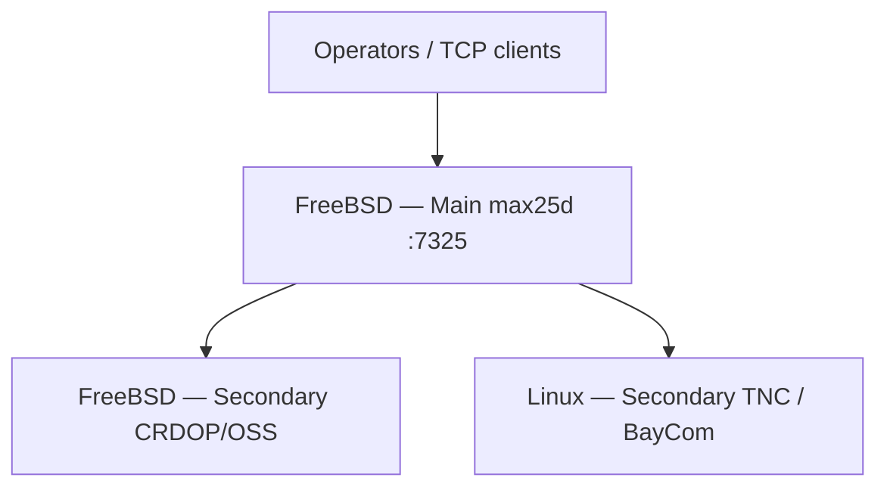

# Architecture

**Main AX.25 Stack (MAX25)** — Packet Radio / AX.25 standalone stack with HyBBX-compatible plugin boundaries.

## Layer model

```
┌─────────────────────────────────────────────────────────┐
│  max25-terminal / max25-client — all platforms (v1)     │
│  F10 menu · CALLERID/CALLID · --ax25-ui                 │
├─────────────────────────────────────────────────────────┤
│  max25d — Main + Secondaries (Linux/KLinux) · M25/1 · RF per instance │
├─────────────────────────────────────────────────────────┤
│  HyBBX (external) — sessions, HBX, BBS                  │
│  Plugins: packet_radio | baycom | crdop                 │
├─────────────────────────────────────────────────────────┤
│  Operating mode — standalone | service | hybbx-host     │
├─────────────────────────────────────────────────────────┤
│  Hardware — tncs | modems | soft-modems                   │
├─────────────────────────────────────────────────────────┤
│  Device — tnc2c | baycom-ser12 | soft-crdop | …         │
├─────────────────────────────────────────────────────────┤
│  Protocol — KISS | kernel hdlcdrv | AX.25 UI | CRDOP M25 host │
└─────────────────────────────────────────────────────────┘
```

**Split:** `max25d` — **DEV-Level 1:** modular TCP/IP + **Linux + FreeBSD** compat; **DEV-Level 3:** WebSocket; **DEV-Level 4:** CRDOP expansion; then OpenBSD → NetBSD → macOS / Windows. Details: [PLATFORMS.md](PLATFORMS.md) · [V2.0.0-SCOPE.md](V2.0.0-SCOPE.md#dev-levels-roadmap-stack-wide).

## DEV-Levels (stack-wide)

> Approximate orientation (*ca.*) — items may be pulled forward when dependencies allow. See [V2.0.0-SCOPE.md](V2.0.0-SCOPE.md#dev-levels-roadmap-stack-wide).

| DEV-Level | Focus (approx.) |
|-----------|-----------------|
| **DEV-Level 1** (*ca.* current) | Modular TCP/IP Servers Service (Main/Secondary) · Linux + FreeBSD `max25d` / `max25d0` · platform detection · INI examples · tests · rootless foundation |
| **DEV-Level 2** (*ca.*) | Main + Secondary supervision · cross-host wiring · `max25-tun` sidecar · deeper Linux/FreeBSD integration |
| **DEV-Level 3** (*ca.*) | WebSocket gateway / browser terminal · other mid-tier items (not CRDOP) |
| **DEV-Level 4** (*ca.*) | CRDOP expansion (OSS polish, features, deeper integration) |
| **Later** | AI / assistant · like-features — deferred |

CRDOP stays at **minimal/native** during DEV-Level 1 — enough for FreeBSD TCP/IP path, not a major feature push. FreeBSD-primary / Linux-secondary topology remains the documented split ([below](#example-deployment--freebsd-primary-linux-secondary)).

## Host layout — Main + Secondaries

**Target structure (single host — one supported layout):**

```
┌─────────────────────────────────────────────────────────┐
│  One physical host / server                             │
│  ┌──────────────┐  ┌─────────────┐  ┌─────────────┐     │
│  │ Main max25d  │  │ Secondary 1 │  │ Secondary … │     │
│  │ (required)   │  │ (optional)  │  │ (5+ opt.)   │     │
│  └──────┬───────┘  └──────┬──────┘  └──────┬──────┘     │
│         └─────────────────┴────────────────┘           │
│              M25/1 · HyBBX attach · RF per Secondary    │
└─────────────────────────────────────────────────────────┘
```

| Role | Count | Role |
|------|-------|------|
| **Main** | **1×** | Stack hub — coordination, HyBBX Main attach point, M25/1 `:7325` |
| **Secondary** | **0–5+** (optional) | Additional `max25d` instances — each typically one RF backend |

Main and Secondaries may run on **one host** or on **separate hosts** (see [example deployment](#example-deployment--freebsd-primary-linux-secondary) below). This replaces the earlier “one daemon only” sketch. INI examples and process supervision are **in progress** — do not over-specify ports/paths until layout lands in `share/max25/`.

| Topic | Rule |
|-------|------|
| **Linux TUN (when up)** | Interface name **`max25d0`** only — [NETDEV.md](NETDEV.md) |
| **BayCom on Linux** | **`bcsf0`** unchanged; KISS PTY feeds the owning `max25d` instance |
| **FreeBSD `max25d`** | **Server + CRDOP/OSS** (SoftModem only) — no ARDOP — [FREEBSD-AX25.md](FREEBSD-AX25.md) |

Legacy single-instance and multi-id INI templates remain for backward compatibility until the Main/Secondary layout is fully wired.

**Modular TCP/IP Servers Service** (public name): central **Main** + optional **Secondaries** — [MODULAR-TCPIP-SERVER.md](MODULAR-TCPIP-SERVER.md).

### Example deployment — FreeBSD primary, Linux secondary

**Not mandatory** — a supported and recommended split when you want full TCP/IP integration and CRDOP on *BSD while keeping kernel BayCom and serial TNC hardware on Linux.

| Host | Role | Typical RF / stack |
|------|------|---------------------|
| **FreeBSD** | **Main** (+ optional local Secondary) | Modular TCP/IP hub · **CRDOP/OSS** (`soft-crdop`) · M25/1 entry |
| **Linux** | **Secondary only** | TNC (`tnc2c`, …) · kernel **BayCom** (`bcsf0`) · KISS PTY · optional `max25d0` TUN |

Linux does **not** host the primary TCP/IP / CRDOP path in this pattern — it extends RF capacity as Secondary instances registered with the FreeBSD Main. **ARDOP-plugin** stays on Linux if used; it is separate from CRDOP.



| Topic | Rule |
|-------|------|
| **Main placement** | Typically on the FreeBSD host — full modular TCP/IP service |
| **Linux TUN (when up)** | **`max25d0`** on the Linux Secondary host only — [NETDEV.md](NETDEV.md) |
| **BayCom on Linux** | **`bcsf0`** unchanged; KISS PTY feeds the owning Secondary `max25d` |
| **FreeBSD RF** | **CRDOP/OSS only** in stack defaults — no BayCom/TNC on FreeBSD |
| **Cross-host peers** | Main `[modular_tcp.secondaries]` lists `host:port` of each Secondary (local or remote) |

Templates: `share/max25/max25d.main.ini.example` (Main) · `share/max25/max25d.freebsd.ini.example` (FreeBSD CRDOP Secondary) · `share/max25/max25d.secondary-linux.ini.example` (Linux hardware Secondary). Details: [MODULAR-TCPIP-SERVER.md](MODULAR-TCPIP-SERVER.md) · [PLATFORMS.md](PLATFORMS.md) · [FREEBSD-AX25.md](FREEBSD-AX25.md).

## Operator access — no root (v2 mandatory)

**Policy (from v2.0.0 onward):** day-to-day MAX25 operation — including bringing BayCom up — must **not** require root. Target users include Raspberry Pi and homeserver operators without deep Linux experience (Windows-familiar admins welcome).

| Release | Model |
|-------|--------|
| **v1.0.0** | Transitional — `baycom-pr-ctl` and often `max25d` still invoked via `sudo` ([BAYCOM.md](BAYCOM.md)) |
| **v2.0.0+** | **Mandatory** — one-time privileged install/setup; operator runs `max25-ctl start` and `max25-terminal` as a normal user in `dialout` / `max25` groups |

Privileged work (kernel modules, `/etc` templates, UART probe) is confined to **install or first-run**, not every session. Details and acceptance gates: [V2.0.0-SCOPE.md](V2.0.0-SCOPE.md).

## Directory layout

```
MAX25-Stack/
├── plugins/           Registry — operating mode / hardware / device
├── stacks/
│   ├── tncs/          Serial TNC tools (TNC2C, PK-TNC2 planned)
│   ├── baycom-pr/     Kernel BayCom lifecycle
│   ├── crdop/         MAX25-SoftModem (CRDOP — MAX25-SoftModem) — sound-card AX.25 modem
│   ├── daemon/        max25d + kiss_bridge.py
│   └── terminal/      max25-terminal / max25-client
├── scripts/           build.sh, max25-ctl, discover-plugins, release-check
├── share/max25/       max25d.ini examples, systemd unit
├── share/hybbx/       HyBBX INI snippets per device
└── docs/              [README.md](README.md) — doc index
```

## Plugin hierarchy

| Type | Path | Responsibility |
|------|------|----------------|
| **Operating mode** | `betriebsform/*` | Standalone, service, HyBBX host role |
| **Hardware** | `hardware/*` | Stack path, HyBBX plugin name |
| **Device** | `devices/*` | Serial params, INI, scripts |

Registry: `plugins/manifest.yaml`. Discovery CLI (`discover-plugins.sh`) lists **hardware** and **device** only — not operating modes.

## max25d (daemon — mainstream OS only)

**Port order:** **DEV-Level 1** — Linux/KLinux + **FreeBSD 15.1+** (modular TCP/IP, minimal CRDOP/OSS) together; **DEV-Level 3** — WebSocket; **DEV-Level 4** — CRDOP expansion; then OpenBSD → NetBSD → macOS X+ → Windows 10+. See [PLATFORMS.md](PLATFORMS.md).

| Responsibility | Detail |
|----------------|--------|
| M25/1 IPC | TCP `:7325`, Unix `/run/max25/modem.sock` |
| **Linux RF device** | Per **Secondary** instance on Linux/KLinux — see [Host layout](#host-layout--main--secondaries) |
| `[devices]` INI | One active id per host; legacy multi-id templates deprecated for new sites |
| KISS bridge | `kiss_bridge.py` — serial KISS for TNC paths |
| Stack lifecycle | boot-wait, BayCom kernel, `crdopc` start |
| TCP auth | Plain-text `AUTH` when `tcp_password` set |

Config: `share/max25/max25d.ini.example`. Daemon README: [stacks/daemon/README.md](../stacks/daemon/README.md).

## Merged stack roles

| Stack | Owns | Does not own |
|-------|------|--------------|
| `stacks/tncs` | TNC2C boot-wait, probe, health | HyBBX sessions |
| `stacks/baycom-pr` | Kernel module, KISS PTY, AX.25 port sync | HyBBX HBX |
| `stacks/crdop` | MAX25-SoftModem (CRDOP) — sound IN/OUT, acoustic AX.25, max25d TCP | KISS serial to TNC |

Link stack READMEs — do not duplicate operator detail here.

## HyBBX attachment

MAX25 is the **modem/TNC owner**. HyBBX:

1. Waits for stack ready (boot-wait OK, or `baycom-pr-ctl status`)
2. Opens serial, KISS PTY, or CRDOP TCP per `share/hybbx/*.ini.example`
3. Bridges to Main over HBX

Contract: [HYBBX.md](HYBBX.md).

## Operating mode matrix

| Mode | Radios | Typical path | HyBBX role |
|------|--------|--------------|------------|
| `standalone` | 1 | Any active device | Optional local Main |
| `service` | 1–2 | Dual INI templates | Secondary 24/7 |
| `hybbx-host` | 1 per section | Device plugin scripts | Secondary RF host |

## See also

- [README.md](README.md) — doc index
- [PLATFORMS.md](PLATFORMS.md) — Linux daemon, cross-platform terminal
- [MAX25-CLIENT.md](MAX25-CLIENT.md) — M25/1 binding
- [LINUX-HOST-SETUP.md](LINUX-HOST-SETUP.md) — example host install
