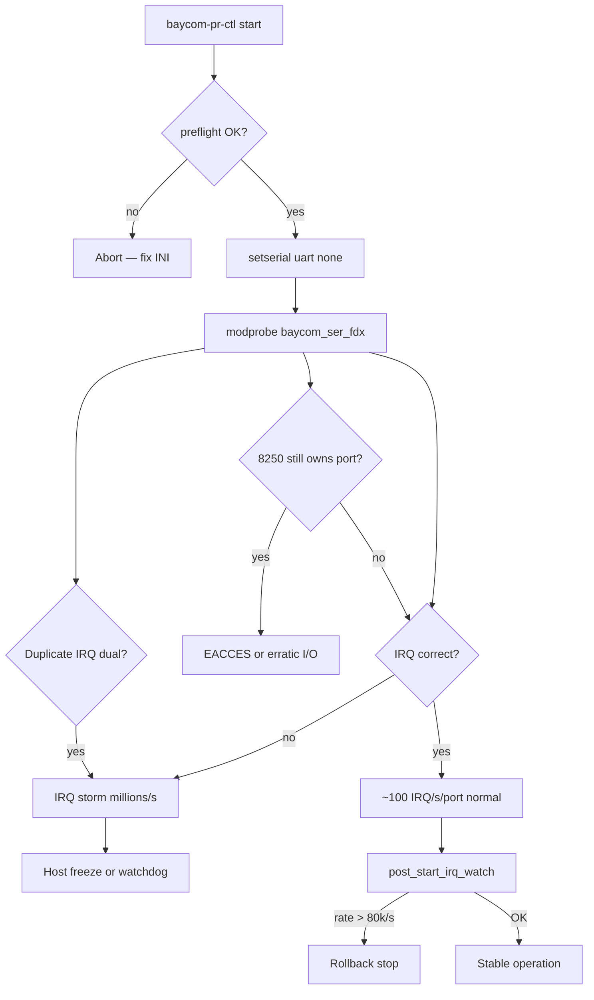

# BayCom Kernel Driver Analysis

**Kernel tree:** `/usr/src/linux-6.18.38` (symlink `/usr/src/linux`)  
**Running kernel:** 6.18.38  
**Analysis date:** 2026-07-08  
**Scope:** All BayCom-related kernel drivers (serial, parallel, EPP) plus USB/KISS paths used with BayCom modems.  
**Userspace cross-reference:** BayCom PR-Stack (`stacks/baycom-pr`)

---

## Executive Summary

The Linux kernel has **no dedicated BayCom USB driver**. USB modems run over **KISS on ttyUSB/ttyACM** (`mkiss` in the kernel or `baycom_kiss_serial` in the PR stack). For serial ser12 modems (PC-COM, classic COM ports), **`baycom_ser_fdx`** is the relevant driver; parallel-port modems use **`baycom_par`** (par96/picpar) or **`baycom_epp`** (EPP, 32-bit only).

The drivers date from **1996-2000** (Thomas Sailer, HB9JNX). They use **direct I/O port access** and **high IRQ load** (~100 IRQ/s per ser12 port in receive). **Wrong IRQ number, duplicate IRQ, or UART conflict with the 8250 driver** are the most common causes of **system freezes** - especially with dual PC-COM (e.g. ttyS0+ttyS5 with IRQ 4 and IRQ 30).

The PR stack already addresses this with `preflight`, `setserial uart none`, staged dual start, and IRQ-storm rollback. **The kernel side still lacks safeguards** (IRQ rate limiting, 8250 conflict checks, IRQ source validation).

### Top findings (prioritized)

| Prio | Finding | Impact |
|------|---------|--------|
| **P0** | Wrong IRQ / duplicate IRQ on `baycom_ser_fdx` | IRQ storm, host freeze |
| **P0** | UART conflict (8250 + baycom on same port) | I/O busy, unstable behavior |
| **P1** | `ser12_set_divisor()` during TX can trigger IRQ storm | Documented in source, no protection |
| **P1** | ISR calls `local_irq_enable()` and heavy HDLC work in IRQ context | Latency, re-entrancy risk |
| **P1** | `baycom_ser_hdx`: IRQ limited to 2-15 | **Unusable for IRQ 30** (PC-COM ttyS5) |
| **P2** | `baycom_epp`: Kconfig `!64BIT` - unavailable on amd64 | EPP modem unsupported |
| **P2** | No hotplug/runtime PM for USB path (by design: userspace) | Expected behavior |
| **P3** | Legacy code: `outb()` on MSR, outdated APIs, missing compat-ioctl | Maintainability |

---

## Source Inventory

| File | Lines | Role |
|------|------:|------|
| `drivers/net/hamradio/baycom_ser_fdx.c` | 678 | **Primary** ser12 full-duplex (bcsf0–3) |
| `drivers/net/hamradio/baycom_ser_hdx.c` | 727 | Legacy ser12 half-duplex (bcsh0–3) |
| `drivers/net/hamradio/baycom_par.c` | 598 | Parallel par96/picpar (bcp0–3) |
| `drivers/net/hamradio/baycom_epp.c` | 1316 | EPP high-speed (bce0–3) |
| `drivers/net/hamradio/hdlcdrv.c` | 767 | Shared HDLC/KISS/AX.25 layer |
| `drivers/net/hamradio/mkiss.c` | 980 | **USB/serial KISS** (not BayCom-specific) |
| `include/uapi/linux/baycom.h` | 39 | `BAYCOMCTL_GETDEBUG` ioctl |
| `include/uapi/linux/hdlcdrv.h` | — | Channel/modem ioctls |
| `Documentation/networking/device_drivers/hamradio/baycom.rst` | — | Upstream docs |

**Kconfig:** `drivers/net/hamradio/Kconfig` — options `BAYCOM_SER_FDX`, `BAYCOM_SER_HDX`, `BAYCOM_PAR`, `BAYCOM_EPP`.

**Not BayCom but related:** `bpqether.c` (BPQ over Ethernet), `yam.c`, `scc.c`, `6pack.c`.

---

## USB Path (no native BayCom USB driver)

### Finding

There is **no** `baycom_usb.c` or similar in the kernel tree. USB BayCom/TNC devices speak **KISS over a USB-serial interface** (CDC-ACM or FTDI/etc.).

### Kernel option: `mkiss`

- **Module:** `mkiss` (`CONFIG_MKISS`)
- **Binding:** `mkiss attach <tty> <ifname>` — attaches to existing TTY (e.g. `/dev/ttyUSB0`)
- **Protocol:** KISS framing; AX.25 netdevice
- **Hotplug:** Standard TTY/USB-serial stack handles connect/disconnect; mkiss must be re-attached manually or via udev script
- **Strengths:** Mature, spinlocks on buffers, no raw I/O
- **Gaps:** No automatic BayCom-specific modem setup; user must configure baud and attach

### Userspace option: `baycom_kiss_serial` (PR-Stack)

- **Path:** `tools/baycom_kiss_serial.c`
- **Function:** Byte-for-byte relay between serial/USB device and KISS PTY symlink
- **Backend:** `kiss-serial` in `baycom-pr.ini` — no kernel module load
- **Hotplug:** Bridge exits on `POLLHUP`; `baycom-pr-ctl` must restart
- **Strengths:** Isolates kernel from USB; no IRQ/iobase issues
- **Gaps:** No KISS protocol validation; single-client PTY; no auto-reconnect on unplug

### USB-specific issues

| Issue | Severity | Notes |
|-------|----------|-------|
| No kernel BayCom USB driver | Info | By design; KISS is the protocol boundary |
| `baycom_kiss_serial` no reconnect | Low | Operational; document restart after replug |
| Baud mismatch | Medium | Must match TNC (`kiss_baud` in INI) |
| Concurrent open of ttyUSB | Medium | Preflight checks kernel-ser12 only; USB users should avoid minicom on same device |

---

## Serial / COM Port Drivers

### `baycom_ser_fdx` (primary — used by PR-Stack)

**Interface names:** `bcsf0` … `bcsf3`  
**Module params:** `mode`, `iobase`, `irq`, `baud` (arrays, max 4 ports)

#### Architecture

The driver **does not use the 8250 serial driver**. It maps UART registers directly (`inb`/`outb`) and handles:

- Bit-clock regeneration from CTS transitions (software PLL)
- HDLC encode/decode via shared `hdlcdrv.c`
- PTT via MCR (RTS/DTR manipulation)
- Power feed: continuous `0x00` on THR (TXD low) — **~100 TX-empty IRQs/s** at idle receive

#### Parameter validation (`ser12_open`)

```382:387:/usr/src/linux-6.18.38/drivers/net/hamradio/baycom_ser_fdx.c
	if (!dev->base_addr || dev->base_addr > 0xffff-SER12_EXTENT ||
	    dev->irq < 2 || dev->irq > nr_irqs) {
		printk(KERN_INFO "baycom_ser_fdx: invalid portnumber (max %u) "
				"or irq (2 <= irq <= %d)\n",
				0xffff-SER12_EXTENT, nr_irqs);
```

- Accepts **any IRQ 2 … nr_irqs** (supports IRQ 30 on APIC systems) ✓
- Validates iobase range ✓
- Does **not** verify IRQ is wired to that UART ✗
- Does **not** check 8250 ownership ✗

#### Critical: IRQ storm mechanism

Documented in source (Ignacio Arenaza, 1997):

```184:188:/usr/src/linux-6.18.38/drivers/net/hamradio/baycom_ser_fdx.c
	 * it is important not to set the divider while transmitting;
	 * this reportedly makes some UARTs generating interrupts
	 * in the hundredthousands per second region
```

If **wrong IRQ** is configured, the handler may run on **unrelated hardware events** or **spurious line noise**, causing millions of IRQs/sec → **hard lockup**. The driver has **no rate limiting or emergency disable**.

Normal idle rate: ~100/s (by design). Dual modem doubles load; still manageable **if IRQs are correct**.

#### ISR design concerns

```317:329:/usr/src/linux-6.18.38/drivers/net/hamradio/baycom_ser_fdx.c
 end_transmit:
	local_irq_enable();
	if (!bc->modem.ptt && txcount) {
		hdlcdrv_arbitrate(dev, &bc->hdrv);
		...
	}
	hdlcdrv_transmitter(dev, &bc->hdrv);
	hdlcdrv_receiver(dev, &bc->hdrv);
	local_irq_disable();
```

- **`local_irq_enable()` inside hard IRQ handler** — allows nested interrupts on all CPUs
- **`hdlcdrv_transmitter/receiver`** can be substantial — runs in IRQ context with IRQs enabled
- **No `request_irq` threaded handler** — modern pattern would use `request_threaded_irq` or workqueues
- **Risk:** latency spikes, possible re-entrancy if same IRQ fires again before `local_irq_disable()`

#### UART detection bug (minor)

```353:354:/usr/src/linux-6.18.38/drivers/net/hamradio/baycom_ser_fdx.c
	outb(b1, MCR(iobase));			/* restore old values */
	outb(b2, MSR(iobase));
```

MSR (Modem Status Register) is **read-only** on standard 8250 UARTs. Writing `b2` to MSR has no defined effect; likely harmless but indicates legacy/debug code. Same pattern in `baycom_ser_hdx.c:436`.

#### Module init quirk

```606:609:/usr/src/linux-6.18.38/drivers/net/hamradio/baycom_ser_fdx.c
		if (!mode[i])
			set_hw = 0;
		if (!set_hw)
			iobase[i] = irq[i] = 0;
```

Once any `mode[i]` is empty, **all subsequent ports** get `iobase=irq=0`. Dual-modem modprobe must pass **all** parameters in one line (as PR-Stack does).

#### Dual-modem / PC-COM freeze assessment

Typical reference station / Albrecht PC-COM layout:

| Port | Device | iobase | IRQ |
|------|--------|--------|-----|
| COM1 | `/dev/ttyS0` | 0x3f8 | 4 |
| COM2 (2nd header) | `/dev/ttyS5` | 0xe080 (example) | **30** (APIC, not 3!) |

**Freeze causes (ranked):**

1. **INI irq=3 or irq=4 for ttyS5** — IRQ storm (most common)
2. **Duplicate IRQ** in modprobe arrays — both devices share one interrupt line incorrectly
3. **8250 driver still owns port** — `setserial uart none` not run
4. **minicom/picocom** holding `/dev/ttySx` while driver loaded
5. **Wrong iobase** for non-standard UART (PCI/ISA multiport)

PR-Stack mitigations align with these root causes (`docs/STABILITY.md`, `baycom_preflight.py`).

---

### `baycom_ser_hdx` (deprecated)

**Interface names:** `bcsh0` … `bcsh3`  
**Fixed 1200 baud**, half-duplex only.

#### Critical limitation for modern hardware

```463:465:/usr/src/linux-6.18.38/drivers/net/hamradio/baycom_ser_hdx.c
	if (!dev->base_addr || dev->base_addr > 0x1000-SER12_EXTENT ||
	    dev->irq < 2 || dev->irq > 15)
		return -ENXIO;
```

**IRQ > 15 rejected** — **cannot use PC-COM ttyS5 (IRQ 30)**. Kconfig explicitly marks this driver deprecated. Use `baycom_ser_fdx` only.

#### Higher baseline IRQ rate

Uses divisor 4 or 6 (~28800 or 19200 baud interrupt rate) vs fdx ~100/s idle — more CPU load.

---

## Parallel Port Drivers

### `baycom_par` (par96 / picpar)

**Interface names:** `bcp0` … `bcp3`  
**Module params:** `mode` (`par96`, `picpar`), `iobase`

#### Architecture (good practices)

- Uses **parport subsystem** (`parport_register_dev_model`, `parport_claim`)
- Requires `PARPORT_MODE_PCSPP | PARPORT_MODE_SAFEININT`
- IRQ from parport (`pp->irq`); not user-specified
- Burst I/O: 16 bits per interrupt

#### Issues

| Issue | Location | Severity |
|-------|----------|----------|
| `par96_wakeup()` calls `parport_claim()` without matching release | `baycom_par.c:283-291` | Low (wakeup rarely used) |
| `baycom_setmode()` fallback: `bc->options = !!strchr(modestr, '*')` for unknown modes | `baycom_par.c:405` | Low — confusing DCD mode |
| Heavy work in parport IRQ callback with `local_irq_enable()` | `baycom_par.c:256-278` | Medium — same pattern as serial |
| No parport on many modern PCs | — | Hardware availability |
| `par96` software DCD documented as poor | `baycom.rst:141-145` | Operational — prefer picpar HW DCD |

#### Timing

Driver toggles `PAR96_BURST` strobes in tight loops inside interrupt handler. Requires parport `SAFEININT` — validated at open. **Incorrect parport chipset emulation** could cause data corruption (hardware-dependent).

---

### `baycom_epp` (EPP modem / FPGA)

**Interface names:** `bce0` … `bce3`  
**Kconfig:** `depends on PARPORT && AX25 && !64BIT` — **not built on 64-bit kernels**.

#### Architecture

- Uses **delayed workqueue** (`schedule_delayed_work(..., 1)`) — 1 jiffy polling, not hardware IRQ-driven
- **FPGA config via `call_usermodehelper("/usr/sbin/eppfpga", ...)`** at open
- Custom HDLC in driver (does not use full hdlcdrv path for data plane)

#### Issues

| Issue | Severity |
|-------|----------|
| Unavailable on amd64 | **Blocker** for most current systems |
| `call_usermodehelper` from kernel open | Security/maintainability concern |
| Hardcoded `eppconfig_path[] = "/usr/sbin/eppfpga"` | Deployment fragility |
| EPP timeout → error printk, partial cleanup | Medium |
| `epp_bh` tight poll loop — CPU usage | Medium on loaded systems |
| Duplicate `#define EPP_*` blocks (lines 67-82 and 119-134) | Code quality |

---

## Shared Infrastructure: `hdlcdrv.c`

All BayCom serial and par drivers (except `baycom_epp` data path) register via `hdlcdrv_register()` and share:

- KISS parameter handling (`txdelay`, `persist`, `slottime`, `txtails`, `fulldup`)
- HDLC bit stuffing / CRC (`crc_ccitt`)
- AX.25 netdevice (`ARPHRD_AX25`)
- Ioctl interface (`SIOCDEVPRIVATE`, `HDLCDRVCTL_*`)

#### Issues

| Issue | Location | Notes |
|-------|----------|-------|
| `in_compat_syscall()` → `-ENOIOCTLCMD` | `hdlcdrv.c:496-497` | 32-bit compat ioctls broken |
| `hdlcdrv_receiver/transmitter` use `test_and_set_bit` reentrancy guard | `hdlcdrv.c:163-164, 262-263` | Partial protection; ISR enables IRQs anyway |
| Spinlocks on hbuf but ISR can run with IRQs enabled | hbuf lock | Potential deadlock if same CPU re-enters (unlikely but possible) |
| `hdlcdrv_unregister` calls `close` if still opened | `hdlcdrv.c:728-729` | Good cleanup path |

---

## Cross-Reference: PR-Stack ↔ Kernel

### Backend mapping

| INI backend | Kernel/userspace | Module / binary |
|-------------|------------------|-----------------|
| `kernel-ser12` | Kernel | `baycom_ser_fdx` |
| `kiss-serial` | Userspace | `baycom_kiss_serial` (no kernel BayCom) |

### Config parameter alignment

| INI field | Kernel param | Match? |
|-----------|--------------|--------|
| `iobase` | `iobase=` modprobe | ✓ Must match UART hardware |
| `irq` | `irq=` modprobe | ✓ Must match `setserial -g` |
| `mode` (ser12*) | `mode=ser12*` | ✓ `*` = software DCD |
| `txdelay` | `baycom_sethdlc` → `HDLCDRVCTL_SETCHANNELPAR` | ✓ 10 ms units |
| `baud` | `baud=` (fdx only) | ✓ Default 1200 |
| `serial` | Not passed to kernel | Used for `setserial uart none` only |
| `iface` | `bcsf0`, `bcsf1`, … | Order must match modprobe array order |

### PR-Stack start sequence (kernel-ser12)

1. `baycom_preflight.py` — validate IRQ/iobase, duplicate IRQ, serial idle
2. `setserial /dev/ttySx uart none` — release from 8250
3. Staged dual probe (optional) — one modem at a time + IRQ watch
4. `modprobe baycom_ser_fdx mode=...,iobase=...,irq=...,baud=...`
5. `ip link set bcsfX up`
6. `baycom_sethdlc` — tx delay
7. `post_start_irq_watch` — rollback if >80k IRQ/s
8. `baycom_kissbridge` — KISS PTY ↔ AX.25 iface

### Gaps between stack and kernel

| Gap | Recommendation |
|-----|----------------|
| Kernel never reads `/dev/ttySx` path | Correct — uses iobase/irq only; preflight bridges the gap |
| No kernel feedback of actual IRQ rate | PR-Stack samples `/proc/interrupts` externally |
| `baycom_test` uses `BAYCOMCTL_GETDEBUG` | Requires `BAYCOM_DEBUG` compiled in kernel (always `#define` in source) |
| Stop order: iface down before modprobe -r | Stack implements correctly |

---

## Freeze Risk Assessment



| Scenario | Likelihood | Kernel protection | PR-Stack protection |
|----------|------------|-------------------|---------------------|
| Wrong IRQ (ttyS5 uses 3 instead of 30) | High | None | preflight + IRQ watch |
| Duplicate IRQ dual modem | Medium | None | preflight + validator |
| 8250 conflict | Medium | None (`request_region` may fail) | `setserial uart none` |
| minicom on raw UART | Medium | None | preflight lsof |
| Divisor change during TX storm | Low | Comment only | N/A |
| Dual modem correct config | — | ~200 IRQ/s total | Staged probe |

---

## Recommended Fixes (prioritized)

### P0 — Critical (stability)

#### 1. IRQ storm circuit breaker (kernel patch suggestion)

Add to `ser12_interrupt()` in `baycom_ser_fdx.c`:

- Count interrupts per jiffy/HZ
- If rate exceeds threshold (e.g. 10× expected = 1000/s), disable IER and log once
- Expose via `BAYCOMCTL_GETDEBUG` or sysfs

**Rationale:** Last-resort protection when userspace preflight is skipped.

#### 2. Document IRQ 30 requirement (done in PR-Stack)

Ensure all operator docs state: **verify with `setserial -g`**, never assume COM2=IRQ3.

#### 3. Never use `baycom_ser_hdx` for PC-COM

Hard-limit in PR-Stack validator if driver=baycom_ser_hdx and irq>15.

### P1 — High (reliability)

#### 4. Threaded IRQ or workqueue for HDLC processing

Move `hdlcdrv_transmitter/receiver/arbitrate` out of hard IRQ context:

```c
/* Suggested pattern */
static irqreturn_t ser12_interrupt(int irq, void *dev_id)
{
    /* minimal: read IIR, queue work, write THR for power */
    schedule_work(&bc->rx_work);
    return IRQ_HANDLED;
}
```

#### 5. Guard `ser12_set_divisor()` with PTT/modem state lock

Refuse divisor changes while `bc->modem.ptt` is set (partially done — review all call paths).

#### 6. 8250 conflict detection

Before `request_region`, check `/proc/ioports` or try `serial8250` reservation API; fail with clear message.

#### 7. Remove invalid `outb(b2, MSR(...))` in UART probe

Replace with proper loopback test reading MSR after MCR loopback enable.

### P2 — Medium (maintainability / modern kernels)

#### 8. `baycom_epp` 64-bit port or deprecate officially

Either fix pointer/size issues for amd64 or document removal; currently Kconfig excludes it.

#### 9. Replace `call_usermodehelper(eppfpga)` with firmware loader or userspace-only init

#### 10. Implement compat ioctl for `hdlcdrv` (`CONFIG_COMPAT`)

#### 11. Conditional `BAYCOM_DEBUG` via Kconfig instead of `#define`

### P3 — Low (quality)

#### 12. Fix typo `BAYCOM_SER_FSX` → `BAYCOM_SER_FDX` in error message (`baycom_ser_fdx.c:395`)

#### 13. `baycom_kiss_serial`: optional USB hotplug reconnect via udev

#### 14. par96 wakeup handler: remove or fix `parport_claim` logic

---

## Suggested Kernel Patch Sketches

Patches belong in the kernel tree, not pc-com. Sketches for upstream or local builds:

### Patch A: IRQ rate emergency shutoff (baycom_ser_fdx.c)

```c
/* In struct baycom_state, add: */
unsigned int irq_rate_count;
unsigned long irq_rate_last;

/* At start of ser12_interrupt: */
bc->irq_rate_count++;
if (time_after(jiffies, bc->irq_rate_last + HZ)) {
    if (bc->irq_rate_count > 5000) {  /* 5x normal max */
        outb(0, IER(dev->base_addr));
        pr_crit("baycom_ser_fdx: IRQ storm on irq %u, disabled\n", dev->irq);
        return IRQ_HANDLED;
    }
    bc->irq_rate_count = 0;
    bc->irq_rate_last = jiffies;
}
```

### Patch B: ser_hdx IRQ limit (if driver kept)

```c
-       dev->irq < 2 || dev->irq > 15)
+       dev->irq < 2 || dev->irq > nr_irqs)
```

---

## Testing Recommendations

| Test | Command / method |
|------|------------------|
| IRQ rate baseline | `watch -n1 'grep baycom /proc/interrupts'` — expect ~100/s per port |
| Preflight | `sudo baycom-pr-ctl preflight` |
| Staged dual | Default start with dual INI |
| Wrong IRQ injection | Temporarily set wrong irq in INI on test bench — confirm IRQ watch catches |
| USB path | `kiss-serial` backend, unplug/replug ttyUSB |
| Parallel | `modprobe baycom_par mode=picpar iobase=0x378` on hardware with LPT |

---

## References

- Kernel docs: `Documentation/networking/device_drivers/hamradio/baycom.rst`
- PR-Stack stability: `docs/STABILITY.md`
- PR-Stack config: `docs/CONFIGURATION.md`
- Control script: `scripts/baycom-pr-ctl` (modprobe, IRQ watch, staged start)
- Preflight: `tools/baycom_preflight.py`

---

## Appendix: Module Parameter Examples

```bash
# Single ser12 (COM1)
modprobe baycom_ser_fdx mode=ser12* iobase=0x3f8 irq=4 baud=1200

# Dual PC-COM (example — verify iobase/irq with setserial -g)
modprobe baycom_ser_fdx \
  mode=ser12*,ser12* \
  iobase=0x3f8,0xe080 \
  irq=4,30 \
  baud=1200,1200

# Parallel picpar
modprobe baycom_par mode=picpar iobase=0x378

# USB KISS (no baycom module)
# mkiss attach /dev/ttyUSB0 mkiss0  # traditional
# Or PR-Stack kiss-serial backend
```

---

*Analysis performed read-only on `/usr/src/linux-6.18.38`. No kernel sources were modified.*
